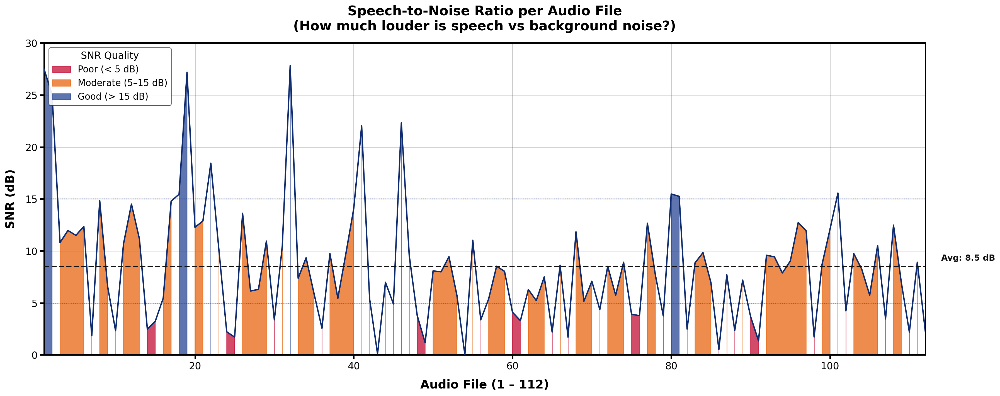
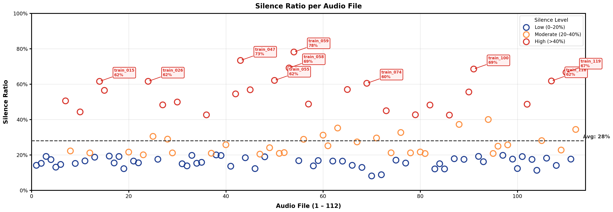
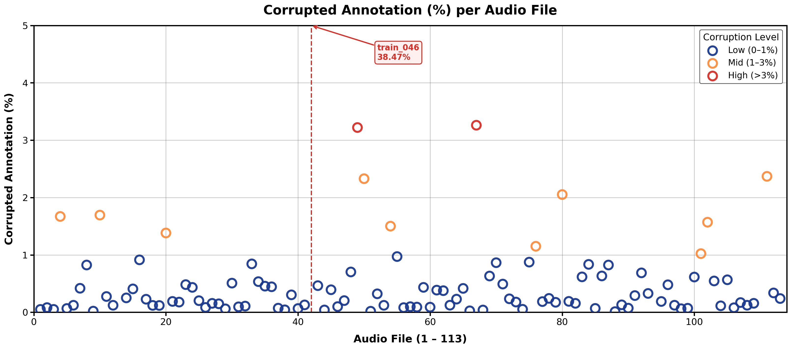
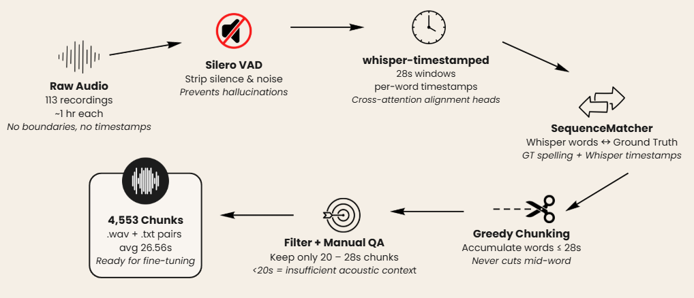
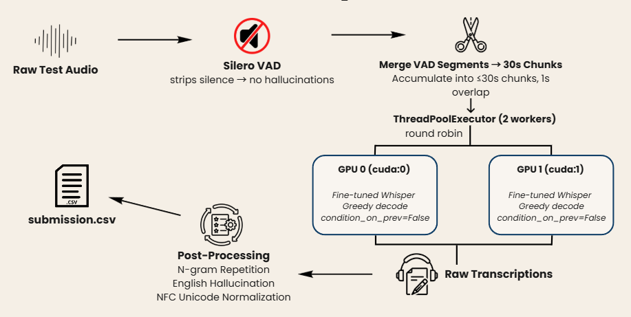
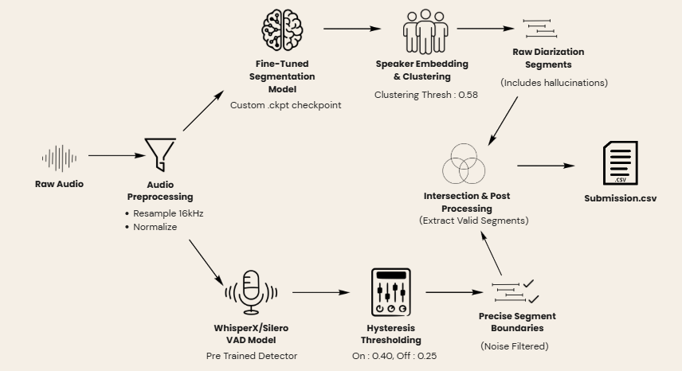

# Luck Is All You Need

**DL Sprint 4.0 | BUET CSE FEST 2026**

Two-task competition on Bengali long-form audio: automatic speech recognition and speaker diarization. Our pipeline cut WER by 63% from the raw baseline and reduced DER by 54% from the out-of-the-box diarization model.

| Task | Metric | Score |
|------|--------|-------|
| Task 1 — Bengali Long-form ASR | WER (Public / Private) | **0.25155 / 0.27759** |
| Task 2 — Bengali Speaker Diarization | DER (Public) | **19.4%** |

- [Task 1 Leaderboard](https://www.kaggle.com/competitions/dl-sprint-4-0-bengali-long-form-speech-recognition/leaderboard)
- [Task 2 Leaderboard](https://www.kaggle.com/competitions/dl-sprint-4-0-bengali-speaker-diarization-challenge/leaderboard)
- [Paper: WhisperAlign (arXiv:2603.04809)](https://arxiv.org/abs/2603.04809)

---

## Team

| | Name | Affiliation |
|---|------|-------------|
| | Aurchi Chowdhury | CSE, BUET |
| | Sk. Ashrafuzzaman Nafees | CSE, BUET |
| | Rubaiyat-E-Zaman | CSE, BUET |

---

## Repository Structure

```
├── ASR/
│   ├── luckisallyouneed-chunk-whisper-timestamped.ipynb   # WhisperAlign chunking pipeline
│   ├── luckisallyouneed-finetune-tugstugi.ipynb           # Fine-tuning on chunked data
│   └── luckisallyouneed-inference-finetunedtugstugi.ipynb # Dual-GPU inference
├── Diarization/
│   ├── luckisallyouneed-finetune-segmentationmodel.ipynb  # Pyannote segmentation fine-tuning
│   └── luckisallyouneed-inference-diarpyannwhispx.ipynb   # Dual-VAD diarization inference
├── img/
└── Presentation.pdf
```

---

# Task 1: Bengali Long-form Speech Recognition

## Dataset

| Split | Recordings | Duration | Words |
|-------|-----------|----------|-------|
| Train | 113 (1 corrupted: `train_089.wav`) | 108.64 hrs (avg 57.68 min) | 650,065 (avg 5,753/file) |
| Test  | 24 | 22.20 hrs (avg 55.49 min) | — (no annotations) |

The training data provides only paragraph-level text — no timestamps, no utterance boundaries.

## Exploratory Data Analysis

**Signal-to-Noise Ratio** — average 8.5 dB across the corpus; most files fall in the moderate (5–15 dB) band. A handful of files are below 5 dB (poor quality).



**Silence Ratio** — average 28% silence per file. Several outlier recordings exceed 60–70% silence (e.g., `train_047`: 73%, `train_059`: 78%), which would cause Whisper to hallucinate over long silent regions.



**Annotation Quality** — most files have <1% corrupted ground-truth tokens. `train_046` is a severe outlier at 38.47% corruption and was excluded from fine-tuning.



## Challenges

1. **Where to cut?** Each recording is ~1 hour with no timestamp annotations. Whisper requires ≤30 s segments; naive fixed cuts break words mid-utterance, destroying context.
2. **Whisper hallucinates.** Hard cuts mid-word cause context loss and garbage output, especially over silence.
3. **No low-resource tooling.** No Bengali phoneme dictionaries, no pre-built forced aligners, no annotated boundary datasets.

## Solution: WhisperAlign

A self-contained, word-boundary-aware chunking pipeline using Whisper's own cross-attention alignment heads — no external tools needed.

### Data Preprocessing Pipeline



| Step | Tool / Method | Detail |
|------|---------------|--------|
| 1 | **Silero VAD** | Strip silence and noise — prevents hallucinations in subsequent steps |
| 2 | **whisper-timestamped** | 28 s sliding windows; extracts per-word timestamps via cross-attention alignment heads |
| 3 | **SequenceMatcher** | Aligns Whisper's decoded words to ground-truth spelling; preserves GT spelling with Whisper timestamps |
| 4 | **Greedy Chunking** | Accumulates words up to ≤28 s; never cuts mid-word |
| 5 | **Filter + Manual QA** | Keep only 20–28 s chunks; <20 s is insufficient acoustic context |

**Output:** 4,553 `.wav`/`.txt` pairs, average 26.56 s — ready for fine-tuning.

### Model Selection

Four Bengali ASR models were benchmarked with the same inference setup before any fine-tuning:

| Model | Backbone | Parameters | WER (Public) |
|-------|----------|-----------|-------------|
| hanx | Facebook wav2vec2-xls-r | 1 B | 0.46932 |
| **tugstugi** | **OpenAI Whisper-medium** | **763.9 M** | **0.41857** |
| qdv206 | ai4bharat/indicwav2vec\_v1\_bengali | 315 M | 0.46680 |
| titu\_stt\_bn\_fastconformer + kenLM | NeMo FastConformer | 120 M | 0.54363 |

`bengaliAI/tugstugi_bengaliai-asr-whisper-medium` was selected as the base model.

### Training Configuration

**Text Normalization (pre-training)**
- NFC Unicode normalization — eliminates invisible encoding inconsistencies
- Non-Bengali characters removed — keep only Unicode block U+0980–U+09FF, ZWJ/ZWNJ, digits, hyphens
- Punctuation stripped — Bengali full stop (।), commas, question marks

**Hyperparameters**

| Epochs | LR | Batch Size | Optimizer | Warmup Steps | Sample Rate |
|--------|----|-----------|-----------|-------------|------------|
| 5 | 1e-5 | 16 × 2 = 32 effective | AdamW | 350 | 16 kHz |

NFC normalization was also applied to both prediction and ground truth before WER calculation.

### Inference Pipeline



- Silero VAD strips silence from raw test audio
- VAD segments are merged into ≤30 s chunks with 1 s overlap
- Chunks are distributed round-robin across two GPUs via `ThreadPoolExecutor`
- Each GPU runs the fine-tuned Whisper with greedy decoding and `condition_on_prev=False`
- Post-processing removes n-gram repetitions, English hallucinations, and applies NFC normalization

### Ablation Results

| System | WER (Public) | WER (Private) |
|--------|-------------|---------------|
| tugstugi — raw, no processing | 0.675 | 0.702 |
| + VAD + post-processing | 0.419 | 0.440 |
| + Unicode normalization | 0.348 | 0.375 |
| + Fine-tuned (WhisperAlign chunking) | 0.265 | 0.296 |
| **+ Manual data cleaning (final)** | **0.251** | **0.278** |

### Findings

**Speed vs. accuracy trade-off**

| Batch Size | WER | RTF | Inference Time (dual T4) |
|-----------|-----|-----|--------------------------|
| 1 (2 effective) | **0.251** | 0.135 | 3 hrs |
| 8 (16 effective) | 0.269 | **0.034** | **46 min** |

**Common error patterns**
- **Banglish words** — the model transcribes English loanwords phonetically in Bengali script (e.g., "welcome" → ওয়ার্কাম, "excuse" → এক্সকিউর)
- **Echo sensitivity** — performance degrades noticeably on recordings with acoustic echo; hallucinations increase when speech boundaries blur

---

# Task 2: Bengali Long-form Speaker Diarization

## Goal

Segment ~1 hour recordings containing up to 22 speakers into mutually exclusive, speaker-timestamped intervals.

## Challenges

1. **Western acoustic priors** — existing diarization models (Pyannote 3.1, etc.) are trained on English/European speech and fail to capture Bangla conversational prosody and turn-taking patterns
2. **Strict non-overlap requirement** — the competition requires mutually exclusive speaker tracks; standard multi-label pipelines produce overlapping segments that must be resolved

## Solution Overview

Domain-adapt Pyannote for Bangla by fine-tuning its segmentation model and introducing a Dual-VAD intersection.

| | DER |
|---|-----|
| Pyannote 3.1 baseline (out-of-the-box) | 42.2% |
| **Our system (public leaderboard)** | **19.4%** |
| Relative reduction | **~54%** |

## Model Selection: Why `speaker-diarization-community-1`?

`pyannote/speaker-diarization-community-1` outperforms Pyannote 3.1 on every conversational benchmark before any fine-tuning, and its `exclusive_speaker_diarization` API natively assigns each frame to the dominant speaker — no manual overlap deletion needed.

| Benchmark Dataset | Domain | Pyannote 3.1 DER | Community-1 DER |
|-------------------|--------|-----------------|----------------|
| AHI (IHM) | Meetings | 18.8% | **17.0%** |
| DIHARD 3 (full) | Diverse | 21.4% | **20.2%** |
| CALLHOME (p2) | Telephone | 28.5% | **26.7%** |
| VoxConverse (v0.3) | Web Video | 11.2% | 11.2% |

## Key Changes

### 1. Bangla-Adapted Segmentation Fine-Tuning

Only the 1.4 M-parameter segmentation head of `pyannote/segmentation-3.0` was fine-tuned on the competition's Bangla training audio. The speaker embedding model was kept frozen — it is already language-agnostic. This surgical fine-tuning teaches the model Bangla speech rhythm and turn-taking patterns without disrupting the embedding space.

### 2. Dual-VAD Intersection (WhisperX ∩ Pyannote)

Pyannote segments are AND-masked against Silero VAD boundaries (onset 0.40, offset 0.25). A Pyannote segment is only kept if it overlaps a confirmed speech region from the independent VAD by at least 0.1 s. This eliminates hallucinated segments caused by background noise while keeping original Pyannote boundary timestamps.

## Pipeline Architecture



The pipeline runs two branches in parallel from preprocessed audio (16 kHz, peak-normalized):

**Branch A — Pyannote diarization**
1. Fine-tuned segmentation model (custom `.ckpt` checkpoint)
2. Speaker embedding & clustering (threshold 0.58)
3. Raw diarization segments (may include hallucinations)

**Branch B — VAD**
1. WhisperX / Silero VAD model
2. Hysteresis thresholding (on: 0.40, off: 0.25)
3. Precise, noise-filtered speech boundaries

Both branches feed into **intersection & post-processing**, which retains only Pyannote segments confirmed by VAD speech regions, applies adaptive segment merging, and outputs the final `submission.csv`.

**Key hyperparameters**

| Parameter | Value |
|-----------|-------|
| Clustering threshold | 0.58 |
| VAD onset / offset | 0.40 / 0.25 |
| Min speech duration | 0.15 s |
| Base merge gap | 0.4 s |
| Fine-tuning epochs | 30 |
| Fine-tuning LR | 1e-4 |
| Segmentation chunk duration | 10 s |
